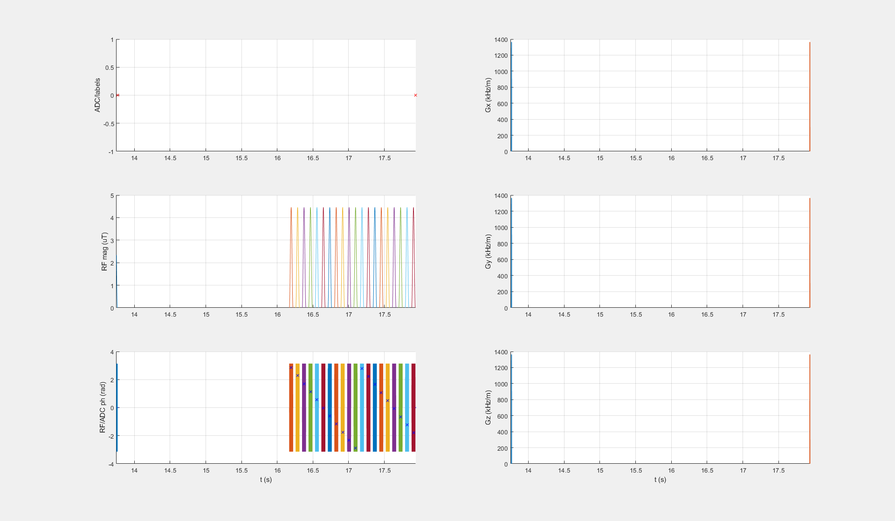

# Getting started
Have a look at the saturation events by running:
```Matlab
>> seq = SequenceSBB;
>> seq.read('APTw_3T_example.seq');
>> seq.plotSaturationPhase();
```

These commands load the .seq-file containing all preparation events and plots a single preparation period (from the first to the second ADC event).

You should see something similar to this:



If you want to run the Bloch-McConnell simulation for that Z-spectrum experiment with a example setting for 3 T, just run
```Matlab
>> simulateExample
```

The simulation runs the Bloch-McConnell simulation of the [.seq-file](APTw_3T_example.seq) for the simulation setting defined in the [.yaml-file](GM_3T_example_bmsim.yaml). You should see a plot of the Z-spectrum and the MTR<sub>asym</sub> curve.

## .yaml parameter files
Simulation parameter definitions in yaml files allows to share settings without the need to adapt any code. The files can be viewed and edited with a simple text editor. All parameters for the simulation are quickly described here:

### Water Pool (mandatory)  
```
water_pool: {
  f:  1,
  t1: 1.3,
  t2: 75.0e-3
}
```
* f: proton fraction (relative) (float)
* t1: T1 [s] (float)
* t2: T2 [s] (float)

### CEST pool(s) (optional)
An arbitrary number of pools ca be set here, by just adding new pools in the *cest_pool* dict. 
```
cest_pool: {
  'Amide': {
    f: 6.4865e-04,
    t1: 1.3,
    t2: 100.0e-3,
    k: 30,
    dw: 3.5
  },
  'Creatine': {
    f: 1.8018e-04,
    t1: 1.3,
    t2: 100.0e-3,
    k: 1100,
    dw: 2
  }
}
```
* dw: chemical shift from water [ppm] (float)
* k: exchange rate [Hz] (float)

### MT Pool (optional)

A semi-solid MT pool with either a Lorentzian or a SuperLorentzian lineshape can be set as well. 

```
mt_pool: {
  f: 0.05,
  t1: 1.3,
  t2: 1.0e-5,
  k: 23,
  dw: 0,
  lineshape: 'SuperLorentzian'
}
```
* lineshape: string with MT lineshape. Either *Lorentzian* or *SuperLorentzian*


### Field properties 
*b0* and *gamma* are mandatory.
```
b0: 3
gamma: 267.5153
b0_inhom: 0.0
rel_b1: 1
```
* b0: field strength [T] (float)
* gamma: gyromagnetic ratio [rad / uT], default is 267.5153 (float)
* b0_inhom: field inhomogeneity [ppm], default is 0.0 (float)
* rel_b1: relative b1 inhomogeneity, default is 1.0 (float)


### additional optional parameters

```
scale: 0.5
```
* scale: relative Magnetization after recovery between 0 and 1, default is 1 (float)

```
verbose: 0.5
```
* verbose: true, you want some output info from the mex-funtion. Default is false

```
reset_init_mag: true
```
* reset_init_mag: True if magnetization should be reset after each ADC, default is True (bool)

```
max_pulse_samples: 200
```
* max_pulse_samples: sets the number of samples for the shaped pulses, default is 500 (int)

## Multiple Z-spectra for intravoxel dephasing
CEST simulations are usually performed for a single isochromat, i.e. a set of spins resonating at the same resonance frequency. However, in a real system, a sample experiences dephasing due to isochromats resonating at different Larmor frequencies (T<sub>2</sub>*) and therefore multiple isochromats are needed to describe the system more accurate. As CEST preparation pulses are spatially non-selective, the same location for all isochromats can be used. The use of multiple isochromats can be enabled by setting the corresponding parameters in the .yaml-file. There is an example included in [GM_3T_multi_isochromats_example_bmsim.yaml](GM_3T_multi_isochromats_example_bmsim.yaml). 

The different isochromats are simulated as shifted Z-spectra, where the offset frequency follows a Cauchy-Lorentz distribution according to [Stöcker et al.](https://doi.org/10.1002/mrm.22406):

&delta&omega(r) = R<sub>2</sub>' tan(0.9*&pi(X(r)-0.5))

The example uses 32 isochromats and a T<sub>2</sub>* of 65 ms. All isocromats are simulated as an entire Z-spectrum, where parallelization is employed via the [Parallel Computing Toolbox](https://de.mathworks.com/help/parallel-computing/spmd.html) of MATLAB.
```
### water pool
water_pool: {
  f: 1,
  t1: 1.3,
  t2: 75.0e-3,
  # optional parameters for multiple isochromat simulation
  # if these are set, a total amount of isochromats is simulates with a b0 shift following:
  # \delta\omega(r) = 1/t2dash * tan(.9*pi(X(r)-.5))
  # with 1/t2dash = 1/t2star-1/t2
  # see doi:10.1002/mrm.22406 or supporting info of https://doi.org/10.1002/mrm.28825 
  t2star: 65.0e-3,
  isochromats: 32
}
```
